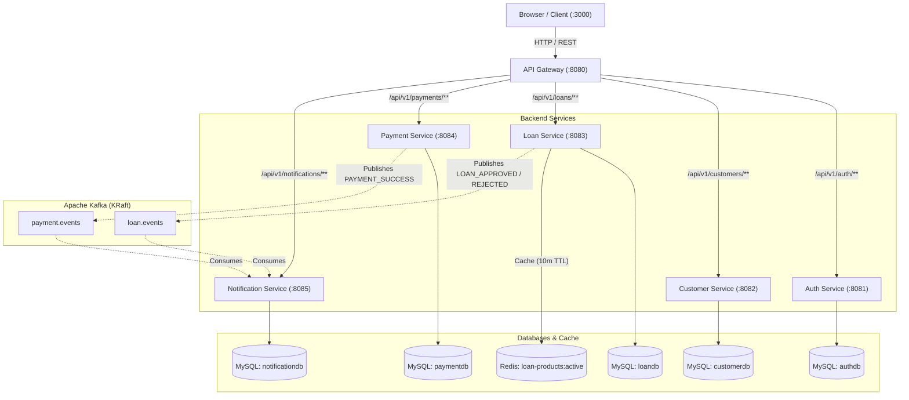

# Loan Forge

[](https://openjdk.org/projects/jdk/17/)
[](https://spring.io/projects/spring-boot)
[](https://spring.io/projects/spring-cloud)
[](https://www.mysql.com/)
[](https://kafka.apache.org/)
[](https://redis.io/)
[](https://docs.docker.com/compose/)

A microservices-based digital lending system that handles borrower onboarding, loan product applications, risk-based approvals, automated repayment schedule calculations, and idempotent payment processing with event-driven notifications.

## Architecture

The system consists of 5 domain services behind an API Gateway, with isolated MySQL databases per service, Redis caching for the loan catalog, and Apache Kafka for asynchronous event handling.



## Tech Stack

| Category | Technology | Version | Purpose in this project |
| :--- | :--- | :--- | :--- |
| Runtime | Java | 17 | Core application runtime |
| Framework | Spring Boot | 3.4.5 | Service framework, REST controllers, JPA repositories |
| Gateway | Spring Cloud Gateway | 2024.0.2 | Reverse proxy, dynamic route dispatch, global CORS |
| Database | MySQL | 8.4 | Primary relational datastore (isolated database per service) |
| Persistence | Spring Data JPA / Hibernate | 6.6.x (Boot BOM) | ORM entities, repositories, and transaction boundaries |
| Migrations | Flyway | 10.21.x (Boot BOM) | Versioned SQL migrations and seed data management |
| Caching | Redis | 7-alpine | In-memory cache-aside layer for active loan products |
| Messaging | Apache Kafka | 3.8.1 | Asynchronous pub/sub for loan status and payment events |
| Security | Spring Security + JJWT | 0.12.6 | Stateless JWT issuance, role-based authorization filters |
| API Docs | Springdoc OpenAPI | 2.8.6 | Interactive Swagger UI and OpenAPI 3 endpoints |
| Testing | JUnit 5 + Mockito | 5.11 / 5.14 | Unit tests and isolated service layer validation |
| Containers | Docker & Docker Compose | Compose v2 | Multi-container local orchestration and health checks |
| Frontend | Vanilla JS / CSS / Nginx | ES6 / Alpine | Interactive single-page dashboard for end-to-end testing |

## Key Engineering Decisions

- **Payment Idempotency via Unique Header & DB Constraint** (`PaymentService.java`, `Payment.java`)  
  Every payment request requires an `Idempotency-Key` header. `PaymentService.pay()` checks `findByIdempotencyKey()` before persisting, backed by a `UNIQUE` index on the `idempotency_key` column. If a client retries due to a network drop or timeout, the existing transaction is returned without re-charging or firing duplicate Kafka events.  
  *Why:* Prevents double-charging customers on client retries or transient network disconnects.

- **Strict Database-per-Service Isolation** (`infra/mysql/init.sql`, `docker-compose.yml`)  
  Rather than sharing a single schema, the system provisions five distinct databases (`authdb`, `customerdb`, `loandb`, `paymentdb`, `notificationdb`). Services never query each other's tables directly and communicate strictly over REST APIs or Kafka events.  
  *Why:* Preserves service boundaries and prevents cross-service database coupling or table-level locks between independent domains.

- **BigDecimal Amortization with Final-Installment Adjustment** (`LoanService.java:generateSchedule`)  
  EMI calculations use `BigDecimal` with 12 digits of intermediate precision (`RoundingMode.HALF_UP`) to compute reducing-balance interest without floating-point errors. On the final installment (`n == tenureMonths`), `principal = remaining balance` is explicitly set to absorb any fractional penny rounding differences.  
  *Why:* Guarantees that the sum of principal payments exactly equals the disbursed loan amount, preventing financial rounding drift.

- **Resilient Cache-Aside Pattern with DB Fallback** (`LoanService.java:activeProducts`)  
  The loan catalog is cached in Redis with a 10-minute TTL. The Redis lookup is wrapped in a try/catch block so that if Redis is down or experiencing network issues, the service automatically falls back to querying MySQL directly.  
  *Why:* Prevents Redis from becoming a single point of failure for loan application browsing.

- **Stateless JWT Authorization with Local Role Parsing** (`SecurityConfig.java`, `JwtAuthenticationFilter.java`)  
  Downstream services parse and validate signed JWTs locally using a shared HMAC secret. User identity and authorities (`ADMIN`, `LOAN_OFFICER`, `CUSTOMER`) are extracted in a `OncePerRequestFilter`, protecting admin endpoints like `/loans/{id}/approve` without hitting `auth-service` on every call.  
  *Why:* Eliminates auth service bottleneck and inter-service latency on every authenticated request.

## API Documentation

Each service exposes interactive Swagger UI documentation locally:

- **Auth Service**: [http://localhost:8081/swagger-ui.html](http://localhost:8081/swagger-ui.html)
- **Customer Service**: [http://localhost:8082/swagger-ui.html](http://localhost:8082/swagger-ui.html)
- **Loan Service**: [http://localhost:8083/swagger-ui.html](http://localhost:8083/swagger-ui.html)
- **Payment Service**: [http://localhost:8084/swagger-ui.html](http://localhost:8084/swagger-ui.html)
- **Notification Service**: [http://localhost:8085/swagger-ui.html](http://localhost:8085/swagger-ui.html)

### Primary Endpoints (Routed via Gateway `:8080`)

| Method | Path | Auth / Headers | Purpose |
| :--- | :--- | :--- | :--- |
| `POST` | `/api/v1/auth/register` | None (Public) | Register customer account and receive JWT access token |
| `GET` | `/api/v1/loans/products` | None (Public) | Browse available loan products, rate, and tenure limits |
| `POST` | `/api/v1/loans/applications` | `Bearer <token>` | Submit a loan application for a chosen product |
| `POST` | `/api/v1/loans/{id}/approve` | `Bearer <token>` (`ADMIN`, `LOAN_OFFICER`) | Approve application, generate EMI schedule, and publish event |
| `POST` | `/api/v1/payments` | `Bearer <token>`, `Idempotency-Key: <key>` | Submit loan installment repayment; publishes payment event |
| `GET` | `/api/v1/notifications` | None / Query `?recipient={id}` | Retrieve generated in-app notifications |

## Getting Started

### Prerequisites

- JDK 17 or higher
- Docker Engine 24+ and Docker Compose v2
- Git

### Running Locally

1. **Clone the repository**:
   ```bash
   git clone https://github.com/your-username/fintech-lending-platform.git
   cd fintech-lending-platform
   ```

2. **Package the services** (builds JARs required by Dockerfiles):
   ```bash
   ./mvnw clean package -DskipTests
   ```

3. **Start all services and infrastructure**:
   ```bash
   docker compose up --build
   ```

4. **Verify running containers**:
   ```bash
   docker compose ps
   ```

### Environment Configuration

The containers use the following environment variables (defined in `docker-compose.yml`):

| Variable | Default (Local Compose) | Purpose |
| :--- | :--- | :--- |
| `DB_URL` | `jdbc:mysql://mysql:3306/<dbname>` | MySQL database connection URL |
| `DB_USERNAME` | `lending` | Database user |
| `DB_PASSWORD` | `lending_dev_password` | Database password |
| `JWT_SECRET` | `change-me-in-development-only-change-me-in-production` | Secret key for JWT signing/verification |
| `REDIS_HOST` | `redis` | Redis host for loan catalog cache |
| `KAFKA_BOOTSTRAP` | `kafka:9092` | Kafka bootstrap broker address |
| `AUTH_URL`, `CUSTOMER_URL`, etc. | `http://<service-name>:<port>` | Gateway proxy routing targets |

### Health Checks

Once started, verify health status:
```bash
curl http://localhost:8080/actuator/health   # Gateway
curl http://localhost:8081/actuator/health   # Auth Service
curl http://localhost:8083/actuator/health   # Loan Service
```

The frontend dashboard is available at [http://localhost:3000](http://localhost:3000).

### Seeded Credentials

| Role | Email | Password |
| :--- | :--- | :--- |
| Admin | `admin@lending.com` | `AdminPassword123` |
| Loan Officer | `officer@lending.com` | `OfficerPassword123` |
| Customer | Register any email via `/api/v1/auth/register` or frontend UI |

## Project Structure

```text
fintech-lending-platform/
├── pom.xml                   # Root Maven POM (manages dependencies & plugin versions)
├── docker-compose.yml        # Orchestrates MySQL, Redis, Kafka, all 6 services & Web UI
├── infra/
│   └── mysql/init.sql        # Database setup script creating individual databases
├── frontend/                 # Static dashboard served via Nginx (port 3000)
└── services/
    ├── api-gateway/          # Spring Cloud Gateway edge router (port 8080)
    ├── auth-service/         # User registration, authentication & JWT issuance (port 8081)
    ├── customer-service/     # Customer profiles and KYC records (port 8082)
    ├── loan-service/         # Product catalog, applications & EMI calculations (port 8083)
    ├── payment-service/      # Repayments with idempotency key deduplication (port 8084)
    └── notification-service/ # Kafka event consumer persisting in-app alerts (port 8085)
```

## Testing

Run tests across all modules using Maven:

```bash
./mvnw clean test
```

### What's Tested

Tests use JUnit 5 and Mockito to verify service logic and controller validation without requiring external infrastructure:

- **auth-service** (`AuthControllerTest`, `JwtServiceTest`): Registration validation, duplicate email rejection, BCrypt password matching, and JWT claim parsing.
- **customer-service** (`CustomerControllerTest`): Profile creation, KYC status assignment, and duplicate profile prevention.
- **loan-service** (`LoanServiceTest`, `LoanControllerTest`): Product limit enforcement (min/max amount, tenure bounds), EMI schedule generation math, state transitions (`PENDING` -> `APPROVED`/`REJECTED`), and Kafka event publishing.
- **payment-service** (`PaymentServiceTest`): Idempotency key handling (returning existing records on duplicate calls), rejection of non-positive amounts, and Kafka payment event dispatch.
- **notification-service** (`EventConsumerTest`, `NotificationControllerTest`): Kafka listener ingestion for `loan.events` and `payment.events`, persistence of notification records, and recipient queries.
- **api-gateway** (`GatewayRouteTest`): Spring context load and route configuration check.

## Live Demo

Deployed at: [URL] (may be stopped outside active demo windows — see note below)

> **Note:** This is a portfolio deployment hosted on single-instance container infrastructure, not a production-configured cluster with auto-scaling or high-availability monitoring.
